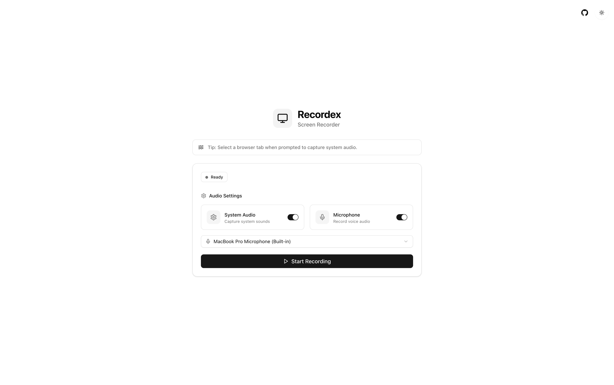

# Recordex

**Recordex** is a modern, web-based screen recorder that captures high-quality videos of your screen along with audio. Built with Next.js and React, it runs entirely in your browser without requiring any software installation.



## Features

- **High-Quality Screen Recording** - Capture your entire screen, application windows, or browser tabs
- **System Audio Capture** - Record audio from browser tabs and applications  
- **Microphone Recording** - Include your voice commentary
- **Audio Mixing** - Combine system audio and microphone input seamlessly
- **Responsive Design** - Works on desktop and mobile devices
- **Dark/Light Theme** - Toggle between themes for your preference
- **Instant Download** - Save recordings directly to your device
- **Video Preview** - Preview recordings before downloading
- **Real-time Timer** - Track recording duration
- **Privacy-First** - All processing happens locally in your browser

## How to Use

1. **Configure Audio Settings:**
   - Toggle system audio capture (recommended for recording browser tabs)
   - Enable microphone if you want to add voice commentary
   - Select your preferred microphone device

2. **Start Recording:**
   - Click "Start Recording"
   - Choose what to share (entire screen, window, or browser tab)
   - For best audio quality, select "Share audio" when prompted

3. **During Recording:**
   - Monitor the real-time timer
   - Use the stop button when finished

4. **After Recording:**
   - Preview your recording
   - Download the video file
   - Clear to start a new recording

## Tech Stack

- **Framework:** Next.js 15.3.4
- **UI Library:** React 19
- **Styling:** Tailwind CSS
- **Components:** Radix UI
- **Icons:** Lucide React
- **Theme:** next-themes
- **Language:** TypeScript
- **Package Manager:** Bun


## 🚀 Getting Started

### Prerequisites

- Node.js 18+ or Bun
- A modern web browser (Chrome, Firefox, or Edge)
- HTTPS connection (required for screen recording APIs)

### Installation

1. **Clone the repository:**
   ```bash
   git clone https://github.com/sachigoyal/recordex.git
   cd recordex
   ```

2. **Install dependencies:**
   ```bash
   bun install
   ```

3. **Start the development server:**
   ```bash
   bun dev
   ```

4. **Open your browser:**
   Navigate to `http://localhost:3000`

### Production Build

```bash
bun build
bun start
```

## Contributing

Contributions are welcome! Please feel free to submit a Pull Request.

1. Fork the repository
2. Create your feature branch (`git checkout -b feature/amazing-feature`)
3. Commit your changes (`git commit -m 'Add some amazing feature'`)
4. Push to the branch (`git push origin feature/amazing-feature`)
5. Open a Pull Request

## License

This project is open source and available under the [MIT License](LICENSE).

## Contributors

- **[Sachi Goyal](https://sachi.dev)** - Creator & Maintainer
  - GitHub: [@sachigoyal](https://github.com/sachigoyal)
  - X: [@sachigoyal27](https://x.com/sachigoyal27)

- **[Rudro](https://rdsx.dev)** - Contributor
  - GitHub: [@rudrodip](https://github.com/rudrodip)  
  - X: [@rds_agi](https://x.com/rds_agi)

## Links

- **Live Demo:** [https://recordex.sachi.dev](https://recordex.sachi.dev)
- **GitHub:** [https://github.com/sachigoyal/recordex](https://github.com/sachigoyal/recordex)
- **Creator:** [https://sachi.dev](https://sachi.dev)

---

Made with ❤️ by [Sachi](https://sachi.dev)
